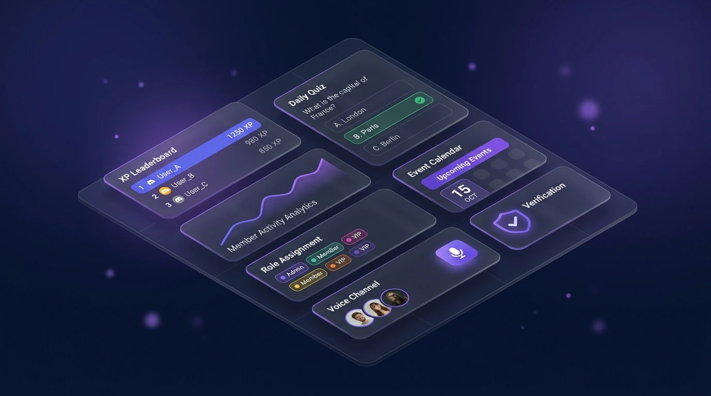
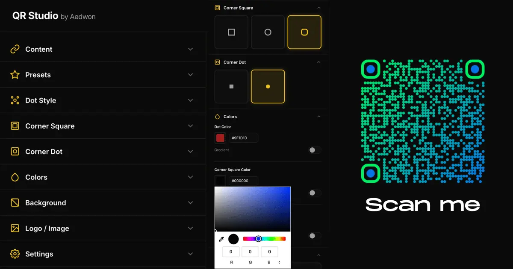
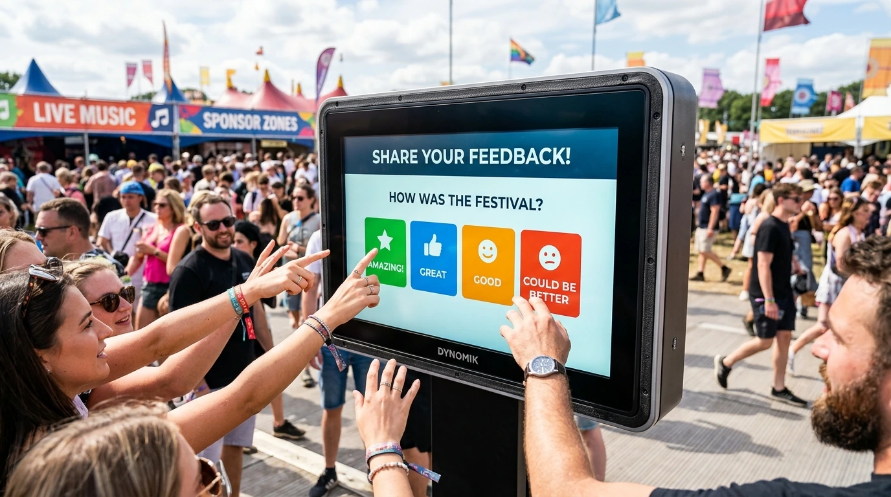
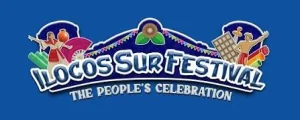
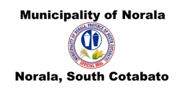
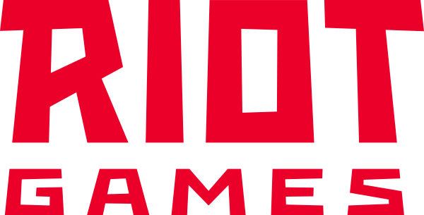
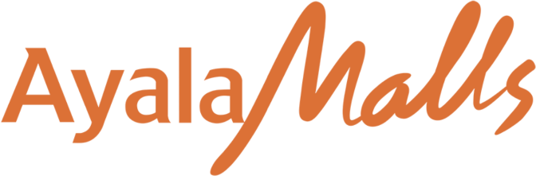
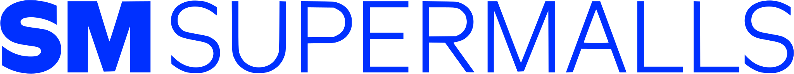
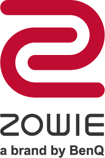
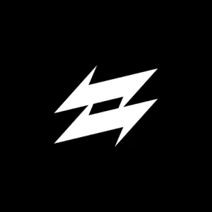

# Aerol Balayon (@Aedwon)

<p align="left">
  <a href="https://aedwon.com"></a>
  <a href="https://linkedin.com/in/aedwon"></a>
  <a href="https://discord.com/users/aedwon"></a>
  <a href="mailto:aerol.balayon@gmail.com"></a>
</p>

I studied Computer Science at the University of the Philippines Diliman on a DOST-SEI Merit Scholarship, following high school at Philippine Science High School.

I build offline-first mobile applications, community operations bots, and civic tech tooling.

---

## Core Technical Stack

<table>
  <tr>
    <td width="25%"><b>Mobile & Offline</b></td>
    <td>
      
      
      
      
      
    </td>
  </tr>
  <tr>
    <td width="25%"><b>Backend & Systems</b></td>
    <td>
      
      
      
      
      
    </td>
  </tr>
  <tr>
    <td width="25%"><b>Frontend & Web</b></td>
    <td>
      
      
      
      
      
      
    </td>
  </tr>
  <tr>
    <td width="25%"><b>Workflows & QA</b></td>
    <td>
      
      
      
      
    </td>
  </tr>
</table>

---

## Featured Systems & Projects

### 1. [Pantas](https://pantas.app) · Flagship Mobile App
> Lead Architect & Developer · 2024 to Present · Flutter, Dart, Drift (SQLite), SQLCipher, Riverpod, FSRS-6

Mobile exam reviewer for Philippine Civil Service and UPCAT entrance tests that functions 100% offline.
- **On-Device Memory Decay:** Implemented the FSRS-6 spaced repetition algorithm in pure Dart with on-device parameter optimization, fitting student retention models locally after 200 reviews without sending logs to cloud servers.
- **Encrypted Local Persistence:** Uses Drift SQLite with 256-bit AES SQLCipher for RA 10173 compliance, delivering sub-15ms query times across 2,216+ question items and an OMR canvas bubble sheet.
- **Offline-First Entitlements:** Uses a fail-open caching policy so verified Pro users never lose access during long offline commutes.

---

### 2. [The MSL Network & League Infrastructure](https://github.com/Aedwon) · Community Platform
> Platform Architect & Operations Lead · 2022 to Present · Python, Discord.py, MySQL, Linux KVM2 VPS, Asyncio

Automated student verification and tournament engine scaling the collegiate gaming community to 10,000+ verified members across 180+ Philippine universities.
- **Automated Verification:** Validates student credentials against campus registrar records, assigning university-specific permissions and competitive divisions.
- **Rate-Limit Resilient Architecture:** Handles tournament check-in spikes across 800+ simultaneous players using token bucket rate limiters and queued role workers, cutting admin overhead by 90%.

<p align="center">
  
</p>

---

### 3. [Norala SB Legislative Transparency Portal](https://github.com/Aedwon) · Civic Tech
> Creator & Full-Stack Architect · 2024 · TypeScript, Next.js, SQLite FTS5, Tailwind CSS, PWA

Municipal digital portal indexing enacted local ordinances and resolutions for the Municipality of Norala, South Cotabato.
- **Sub-Second Full-Text Search:** Uses SQLite FTS5 to index decades of legislative records for fast keyword retrieval on mobile devices.
- **Offline PWA Support:** Caches recent gazette entries via Workbox service workers to ensure readability in rural areas with spotty cellular coverage.

---

### 4. PSO Automated Scorer & Ranking Model · Competition Systems
> Lead Scoring Architect · 2024 · Python, NumPy, Pandas, Google Sheets API

Automated scoring pipeline built for the Philippine Society of Youth Science Clubs (PSYSC), evaluating 4,000+ high school competitors in the National Science Club Month Science Olympiad.
- **Vectorized Matrix Evaluation:** Vectorized NumPy operations grading regional cluster answer keys and applying tier penalties in seconds.
- **Deterministic Multi-Key Ranking:** Automated tiebreaker resolution sorting total scores, difficulty-weighted tiers, and submission timestamps with 100% accuracy.

---

### 5. [QR Studio](https://github.com/Aedwon) · In-Browser Tooling
> Creator · 2024 · TypeScript, HTML5 Canvas, Vite, Tailwind CSS

In-browser QR code builder with gradient pattern customization and vector SVG export.
- **Zero-Network Architecture:** Encodes payload bits and generates Reed-Solomon error correction matrices entirely in memory.
- **Zero Data Leakage:** Generates print-ready vector files with 0ms network latency and zero tracking requests.

<p align="center">
  
</p>

---

### 6. Kiosk Survey · Offline Venue Systems
> Lead Developer · 2023 to 2024 · Flutter, Dart, SQLite, Android TV OS

Touchscreen survey system built for interactive event booths under severe venue cellular congestion.
- **Zero-Loss Journaling:** Attendees submit responses directly to a local SQLite journal on Android TV hardware.
- **Atomic Batch Sync:** Operates continuously for 8 hours without internet connectivity, flushing queued records atomically once a network connection is detected.

<p align="center">
  
</p>

---

### 7. [BetterGov PH](https://bettergov.ph) · Open Source Contributor
> Contributor · 2024 to Present · TypeScript, Next.js, Tailwind CSS

Contributing to civic technology initiatives modernizing Philippine government web portals and public open data accessibility.

---

## Organizations & Brand Partners

Entities and brands I have built software or directed operations for:

### Organizations & LGUs
<p align="left">
  &nbsp;&nbsp;&nbsp;&nbsp;
  &nbsp;&nbsp;&nbsp;&nbsp;
  &nbsp;&nbsp;&nbsp;&nbsp;
  &nbsp;&nbsp;&nbsp;&nbsp;
  &nbsp;&nbsp;&nbsp;&nbsp;
  &nbsp;&nbsp;&nbsp;&nbsp;
  &nbsp;&nbsp;&nbsp;&nbsp;
  &nbsp;&nbsp;&nbsp;&nbsp;
  
</p>

### Event & Brand Partners
<p align="left">
  &nbsp;&nbsp;&nbsp;&nbsp;
  &nbsp;&nbsp;&nbsp;&nbsp;
  &nbsp;&nbsp;&nbsp;&nbsp;
  &nbsp;&nbsp;&nbsp;&nbsp;
  &nbsp;&nbsp;&nbsp;&nbsp;
  &nbsp;&nbsp;&nbsp;&nbsp;
  &nbsp;&nbsp;&nbsp;&nbsp;
  &nbsp;&nbsp;&nbsp;&nbsp;
  &nbsp;&nbsp;&nbsp;&nbsp;
  
</p>

---

<details>
<summary><b>About This Repository & Local Setup</b></summary>

<br />

This repository contains the source code for my personal portfolio website ([aedwon.com](https://aedwon.com)).

### Tech Stack
- **Framework:** Next.js 16 (App Router)
- **UI & State:** React 19, Tailwind CSS, Framer Motion
- **Testing:** Vitest, React Testing Library
- **Icons & Assets:** Lucide React, Simple Icons

### Getting Started

```bash
# Clone the repository
git clone https://github.com/Aedwon/aedwon.git
cd aedwon

# Install dependencies
npm install

# Start local development server
npm run dev

# Run test suite
npm test

# Build production bundle
npm run build
```

</details>

---

<p align="center">
  <sub>Aerol Balayon (@Aedwon) · Built with Next.js & Tailwind CSS</sub>
</p>
